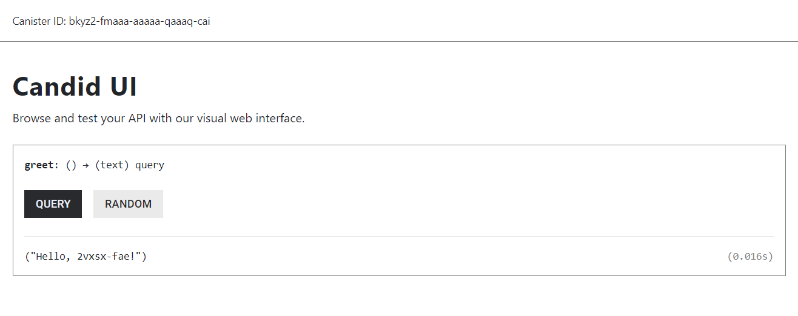

# 3. ic_cdk::api::caller()

Canisterが誰から呼ばれたかという情報はシステムやデータへのアクセス制御を行う上で必要です。

Rust CDKでは、`ic_cdk::api::caller()`関数を呼び出すことにより呼び出し元を取得することができます。

『[1. Hello](../01_hello/README.md)』のサンプルは、パラメータで渡されたname値を「Hello, 〇〇!」の形で返すものでしたが、名前の部分をパラメータで渡された値ではなく、`ic_cdk::api::caller()`関数から返ってきた値にしてみましょう。

以下の2ファイルを編集しましょう。([dfx.json](dfx.json)と[Cargo.toml](Cargo.toml)は同じでOK)

##### [backend.did](backend.did)

```
service : {
    "greet": () -> (text) query;
}
```

##### [src/lib.rs](src/lib.rs)

```rust
#[ic_cdk_macros::query]
fn greet() -> String {
    let caller = ic_cdk::api::caller();
    format!("Hello, {}!", caller)
}
```

## Canister呼び出し

Canisterに配置して呼び出してみましょう。

### (1) Candid UIからの呼び出し

まずは、`dfx deploy`コマンドを実行した際に表示されるCandid UIのURLをWebブラウザに指定して、Candid UIページから呼び出してみます。

`Hello, {}`の`{}`の部分に、callerを識別子らしき値が表示されていることが確認できます。




### (2) dfxコマンドからの呼び出し

`dfx canister call`コマンドを使って、PCのターミナル上からCanisterを呼び出すことができます。

使い方は以下の通りです。

```bash
$ dfx canister call --help
dfx-canister-call 
Calls a method on a deployed canister

USAGE:
    dfx canister call [OPTIONS] <CANISTER_NAME> <METHOD_NAME> [ARGUMENT]

ARGS:
    <CANISTER_NAME>    Specifies the name of the canister to build. You must specify either a
                       canister name or the --all option
    <METHOD_NAME>      Specifies the method name to call on the canister
    <ARGUMENT>         Specifies the argument to pass to the method
︙
```

今回の例では、[dfx.json](dfx.json)に記述した「backend」がCanister名となりますので、以下のように呼び出すと良いでしょう。

```bash
$ dfx canister call backend greet
("Hello, xxxxx-xxxxx-…-xxxxx!")
```

## 別のidentity作成

Candidからの呼び出した場合とdfxコマンドからの呼び出した場合で、callerが異なることを確認できました。

dfxコマンドでは、複数のidentityを管理することができます。

### a. 登録済identity一覧表示

以下のコマンドでidentity一覧を表示することができます。

```bash
$ dfx identity list
anonymous
default *
```

### b. dfxコマンドによる新しいidentity作成

以下のコマンドで作成することができます。

```bash
$ dfx identity new [オプション] <identitiy名>
```

コマンドの詳細や、オプションは以下のように、`dfx identity new --help`を実行すれば確認できます。

```bash
$ dfx identity new --help

USAGE:
    dfx identity new [OPTIONS] <NEW_IDENTITY>

ARGS:
    <NEW_IDENTITY>    The name of the identity to create
︙
```

以下のコマンド実行例は、「test」という名のidentityをつくるものです。

```bash
$ dfx identity new test
Please enter a passphrase for your identity: [hidden]
Encryption complete.
Your seed phrase for identity 'test': XXXX XXXX XXXX …
This can be used to reconstruct your key in case of emergency, so write it down in a safe place.
Created identity: "test".
```

identityの実体はECDSA秘密鍵です。

コマンドを実行すると、自動で秘密鍵が生成され、その秘密鍵を導出できるSeed Phrase (24 words)が表示されます。

また、ユーザーディレクトリにpem (Privacy-Enhanced Mail)ファイルが、passphraseで暗号化された形で保存されます。

```
~/.config/dfx/identity/<identity名>/
├── identity.json
└── identity.pem.encrypted
```

Passphraseは秘密鍵を参照する際に必要なパスワードのようなもので、dfxコマンドなどで秘密鍵を使う場合に毎回入力を求められます。

なお、「`--storage-mode=plaintext`」オプションを指定すれば、passphraseなしのpemファイルを出力することも可能です。

ローカルPC環境向けにテスト用にidentityをつくるだけならとくに問題にはなりませんが、本番稼働しているIC Network上でidentityを使用する場合には、秘密鍵の紛失や流出にはくれぐれもご注意下さい。
