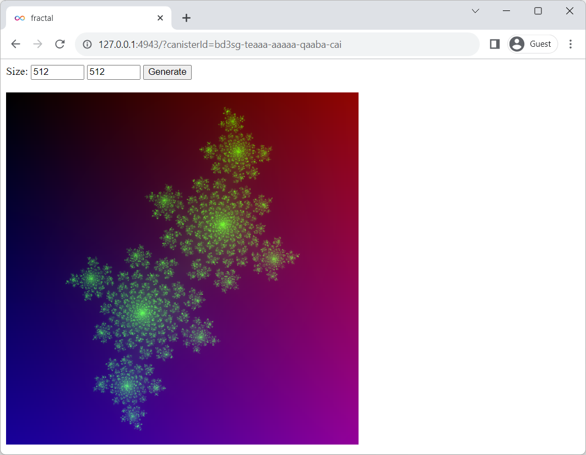

# 5. 動的画像生成

Internet ComputerのBackend Canisterで動的に画像生成してみます。

ここで解説するサンプルは、Frontendから渡した画像サイズをもとにBackendで動的に画像データを生成して返すだけのシンプルなものです。

サンプルの画像生成にはBackend側のデータを利用しないため、実際にはBackendを呼び出さずともFrontend内で生成できますが、Backendで生成する仕組みを応用することで、Blockchainに刻まれたデータに基づいて動的に画像データを生成するといった使い方もできるでしょう。

## 1. テンプレート生成

今回はBackendだけでなく、生成した画像を表示するFrontendも用意しますので、手っ取り早くテンプレート生成を使うことにします。

```bash
$ dfx new --type=rust fractal
$ cd fractal
```

コマンドが成功すると、以下のようなディレクトリ構造でファイルが生成されていると思います。

```
fractal
├── Cargo.lock
├── Cargo.toml
├── README.md
├── dfx.json
├── node_modules
├── package-lock.json
├── package.json
├── src
│   ├── fractal_backend
│   │   ├── Cargo.toml
│   │   ├── fractal_backend.did
│   │   └── src
│   │       └── lib.rs
│   └── fractal_frontend
│       ├── assets
│       │   ├── favicon.ico
│       │   ├── logo2.svg
│       │   ├── main.css
│       │   └── sample-asset.txt
│       └── src
│           ├── index.html
│           └── index.js
└── webpack.config.js
```

## 2. プロジェクト資材修正

### (1) dfx.jsonの編集

テンプレート生成されたものがそのまま使えるのでとくに修正は必要ありません。

### (2) didファイルの編集

Backendを呼び出すためのI/Fを定義します。

引数として画像サイズ (x, y) を渡して、pngデータ (バイナリ)を返すことを考えます。サンプルですのでつくりを単純化するため、Backend側からエラーは返さないものとします。

##### [src/fractal_backend/fractal_backend.did](src/fractal_backend/fractal_backend.did)

```
service : {
    "fractal": (nat32, nat32) -> (blob) query;
}
```

### (3) Backendプログラムの編集

I/Fに合わせてプログラムを用意します。

今回はBackendで動的に画像を生成する方法の確認が目的ですので、生成する画像にはこだわりません。

使用するimage createのページを見ると『Julia fractals』のコード例がありましたので、今回はこれを使ってみることにしましょう。

-[https://crates.io/crates/image](https://crates.io/crates/image)

##### [src/fractal_backend/src/lib.rs](src/fractal_backend/src/lib.rs)

```rust
// An example of generating julia fractals.
// https://crates.io/crates/image
use std::io::Cursor;

#[ic_cdk::query]
fn fractal(imgx:u32, imgy:u32) -> Vec<u8> {
  ︙
  let mut result = vec![];
  imgbuf.write_to(&mut Cursor::new(&mut result), image::ImageOutputFormat::Png).unwrap();
  return result;
}
```

### (4) Rust依存モジュールの追加

Julia fractalsでは計算に複素平面を使用するため、num-complex crateを使います。また、Rust上で画像を扱いpngフォーマットへの変換するために、image crateを追加します。

```bash
$ cargo add num-complex
$ cargo add --features png --no-default-features image
```

プロジェクトルートにあるCargo.tomlはWorkspaceの設定にすぎませんので、

##### [Cargo.toml](Cargo.toml)

```toml
[workspace]
members = [
    "src/fractal_backend",
]
```

実体があるsrc/fractal_backend/Cargo.tomlに依存ライブラリが追加されます。

##### [src/fractal_backend/Cargo.toml](src/fractal_backend/Cargo.toml)

```toml
︙
image = { version = "0.24.7", default-features = false, features = ["png"] }
num-complex = "0.4.4"
```


### (5) Backend呼び出し用のJavaScriptソース生成

FrontendからBackendを呼び出せるよう、JavaScriptソースを生成します。

```bash
$ npm run generate
```

※コマンドの実体は`dfx generate fractal_backend`です。

### (6) index.htmlの編集

あくまでもサンプルですので、画像サイズ (x, y) を入力する`<input>`タグ、画像生成する`<button>`タグ、、生成した画像を表示させる``タグ のみのシンプルなものとします。

```html
<!DOCTYPE html>
<html>
  <head>
    <title>fractal</title>
  </head>
  <body>
    Size:
    <input id="x" type="number" min="100" max="1000" step="1" value="512">
    <input id="y" type="number" min="100" max="1000" step="1" value="512">
    <button id="button">Generate</button>
    <br/><br/>
    
  </body>
</html>
```

### (7) index.jsの編集

buttonがクリックされた場合に、Backendのfractal()関数を呼び出し、取得できたpngデータを``タグに表示する例です。

``タグにpngデータを直接流し込むことはできないため、convertToDataUrl()関数を用意してDataUrl形式に変換し、src属性に設定する方法で実現しています。

```javascript
import { fractal_backend } from "../../declarations/fractal_backend";

document.getElementById("button").addEventListener("click", async (e) => {
  e.preventDefault();
  const x = parseInt(document.getElementById("x").value);
  const y = parseInt(document.getElementById("y").value);

  const png = await fractal_backend.fractal(x, y);
  const blob = new Blob([png], { type: "image/png" });
  const url = await convertToDataUrl(blob);

  button.removeAttribute("disabled");
  document.getElementById("fractal").src = url;

  return false;
});
```

convertToDataUrl()関数はDfinityの[公式サンプル](https://github.com/dfinity/examples/blob/master/rust/qrcode/src/qrcode_frontend/src/index.js#L59-L69)を流用しています。

```javascript
// Converts the given blob into a data url such that it can be assigned as a
// target of a link of as an image source.
function convertToDataUrl(blob) {
  return new Promise((resolve, _) => {
    const fileReader = new FileReader();
    fileReader.readAsDataURL(blob);
    fileReader.onloadend = function () {
      resolve(fileReader.result);
    }
  });
}
```

### (8) dfxサービス起動

```bash
$ dfx start --background --clean
```

### (9) Backend、Frontendのローカル配備

```bash
$ dfx deploy
```

## 実行例



## 参考

- [QR code generator on the Internet Computer](https://github.com/dfinity/examples/tree/master/rust/qrcode)

