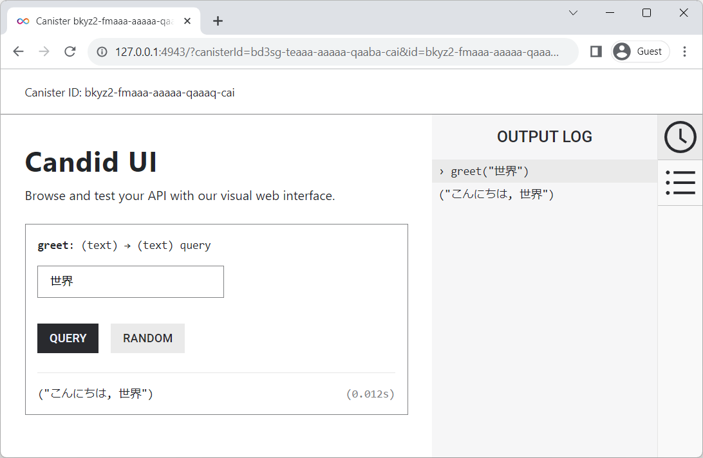

# 6. staticファイル参照

Backend Canisterにstaticファイルを含めたい場合にどのようにすればよいでしょうか。

FrontendのAsset Canisterでは、htmlファイルやjsファイル、pngファイルなどWebコンテンツに必要なファイルをCanisterへ格納できます。

一方、Backend Canisterの場合は、以下のDfinityサンプルを見た限りでは、Canisterにファイルを直接配置するのではなく、Rustの[std::include_bytes!](https://doc.rust-lang.org/std/macro.include_bytes.html)マクロを使用してビルド時に静的ファイルを取り込んでいるようです。

- [QR code generator on the Internet Computer](https://github.com/dfinity/examples/blob/master/rust/qrcode/src/qrcode_backend/src/lib.rs)

『[1. Hello](../01_hello//README.md)』で解説したプログラムをベースに、応答文字列のうち「Hello」の部分を静的ファイルから読み込むようにしてみましょう。この例では、ファイルから参照するデータは文字列ですので、[std::include_str!](https://doc.rust-lang.org/std/macro.include_str.html)マクロを使用することにします。

## 1. プロジェクトの作成

```bash
$ cargo new icptest --lib
$ cd icptest
```

## 2. プロジェクト資材準備

### (1) dfx.jsonの作成

『[1. Hello](../01_hello/README.md)』と同じdfx.jsonを用意します。

###### [dfx.json](dfx.json)

```
{
  "canisters": {
    "backend": {
      "candid": "./backend.did",
      "package": "icptest",
      "type": "rust"
    }
  },
  "defaults": {
    "build": {
      "args": "",
      "packtool": ""
    }
  },
  "output_env_file": ".env",
  "version": 1
}
```

### (2) didファイルの作成

『[1. Hello](../01_hello/README.md)』と同じbackend.didを用意します。

###### [backend.did](backend.did)

```
service : {
    "greet": (text) -> (text) query;
}
```

### (3) [Cargo.toml](Cargo.toml)編集

『[1. Hello](../01_hello//README.md)』と同じCargo.tomlを用意します。

```ini
[package]
name = "icptest"
version = "0.1.0"
edition = "2021"

[lib]
crate-type = ["cdylib"]

[dependencies]
candid = "0.9.11"
ic-cdk = "0.11.3"
```

※2023年11月5日時点の最新バージョン

### (4) [assets/message.txt](assets/message.txt) (静的ファイル)

```
こんにちは
```

### (5) プログラム

##### [src/lib.rs](src/lib.rs)

```rust
use std::include_str;

const MESSAGE:&str = include_str!("../assets/message.txt"); // "Hello"

#[ic_cdk::query]
fn greet(name: String) -> String {
  format!("{}, {}", MESSAGE, name)
}
```

## 3. ビルド & デプロイ

```bash
$ dfx start --clean --background
$ dfx deploy
```

## 4. 実行

Candid UIを開いて実行してみます。


