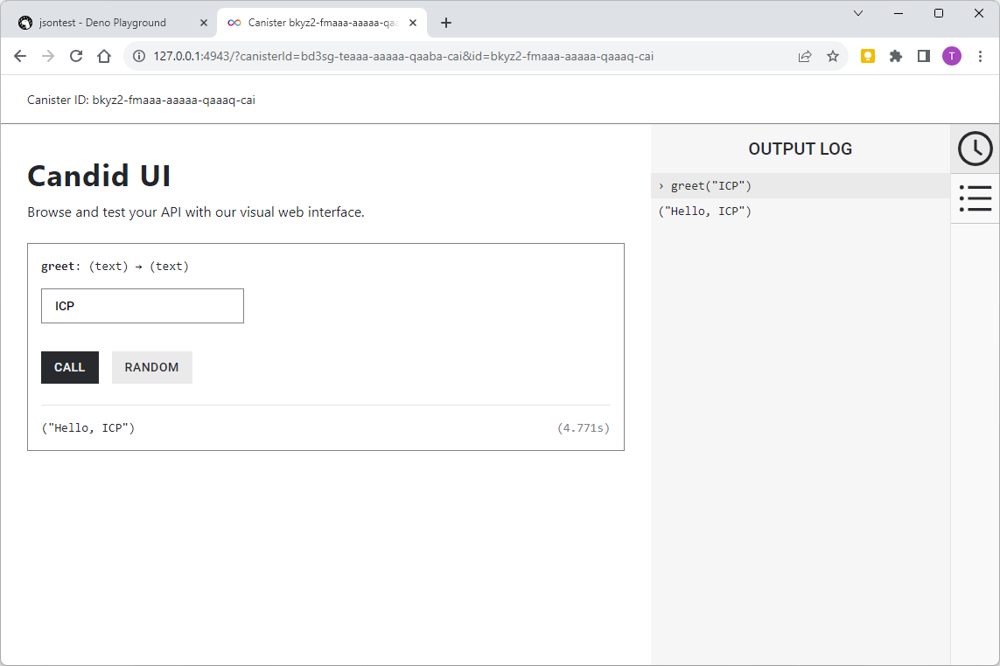
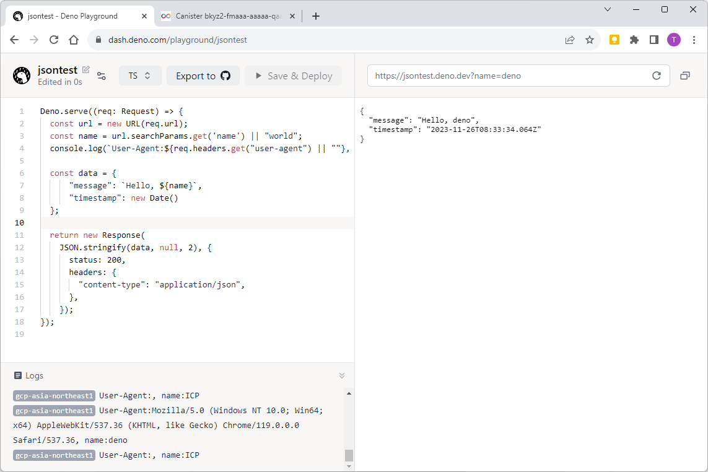

# HTTPS outcalls

Canister上から外部のWebサーバに対してhttpリクエストを発行することができます。

今回のサンプルでは、『[1. Hello](../01_hello/README.md)』と同じインタフェースを持つDappとし、CanisterからさらにWebサーバへリクエストし応答メッセージを呼び出し元へ返すようにしてみます。

## 0. リクエスト先外部Webサーバ準備

今回はテスト用にJSONを返すリクエスト先の外部Webサーバを用意することにします。

手軽にWebサーバを公開できる[Deno Deploy](https://deno.com/deploy)を使用し、サーバが返すJSONデータ内には、複数リクエストを行っても変わらない固定部分と、リクエストごとに異なる可変部分を含めることにしましょう。

##### [https://jsontest.deno.dev/?name=ICP](https://jsontest.deno.dev/?name=ICP)

```json
{
  "message": "Hello, ICP",
  "timestamp": "2023-11-25T00:50:16.252Z"
}
```

##### Deno Deploy用ソースコード(例)

```javascript
Deno.serve((req: Request) => {
  const url = new URL(req.url);
  const name = url.searchParams.get('name') || "world";
  const data = {
      "message": `Hello, ${name}`,
      "timestamp": new Date()
  };
  console.log(`User-Agent:${req.headers.get("user-agent") || ""}, name:${name}`)

  return new Response(
    JSON.stringify(data, null, 2), {
      status: 200,
      headers: {
        "content-type": "application/json",
      },
    });
});
```

## 1. プロジェクトの作成

今回もBackendのみですので、`dfx new`コマンドは使わず、Rustの一般的なライブラリプロジェクトからCanister用のDappをつくることにします。

「icptest」はプロジェクト名ですので、任意に設定して構いません。

## 1. プロジェクトの作成

```bash
$ cargo new icptest --lib
$ cd icptest
```

## 2. プロジェクト資材準備

### (1) dfx.jsonの作成

『[1. Hello](../01_hello/README.md)』と同じdfx.jsonを用意します。

###### [dfx.json](dfx.json)

```json
{
  "canisters": {
    "backend": {
      "candid": "./backend.did",
      "package": "icptest",
      "type": "rust"
    }
  },
  "defaults": {
    "build": {
      "args": "",
      "packtool": ""
    }
  },
  "output_env_file": ".env",
  "version": 1
}
```

### (2) didファイルの作成

『[1. Hello](../01_hello/README.md)』と同じようなbackend.didを用意します。

ただし、greet()関数からHTTPS Outcallsを実行する場合には、Query CallではなくUpdate Callとする必要がありますので（※）、Candidの定義から「query」を取り除いておきましょう。

※[IC0504エラー](https://wiki.internetcomputer.org/wiki/Error_Codes_returned_by_Internet_Computer)が出るようです。


###### [backend.did](backend.did)

```
service : {
    "greet": (text) -> (text);
}
```

### (3) [Cargo.toml](Cargo.toml)編集

『[1. Hello](../01_hello//README.md)』と同じように、libセクションに`crate-type = ["cdylib"]`を追記して、依存ライブラリを追加します。

今回は`candid`, `ic-cdk`にくわえ、URLエンコードのために`urlencoding`も入れておきます。

```bash
$ cargo add candid ic-cdk
$ carg add urlencoding
$ cargo add serde --no-default-features --features derive
$ cargo add serde_json
```

```ini
[package]
name = "icptest"
version = "0.1.0"
edition = "2021"

[lib]
crate-type = ["cdylib"]

[dependencies]
candid = "0.10.0"
ic-cdk = "0.12.0"
serde = { version = "1.0.193", default-features = false, features = ["derive"] }
serde_json = "1.0.108"
urlencoding = "2.1.3"
```

### (4) プログラム

ic-cdk 0.12.0において、以下のように実装することで、HTTPS Outcallを実行することができます。

ローカル環境で動作確認する場合は配備先ノードが1台ですが、IC上では複数ノードに配備されてノードごとにHTTP Outcallが実行されることになります。

複数ノードから同時にHTTPS Outcallが実行される場合、HTTPS応答のコンセンサスを得る必要がありますが、今回用意したテストサーバのように、リクエストごとにJSONデータの一部内容が変わるような場合には、[TransformContext](https://docs.rs/ic-cdk/latest/ic_cdk/api/management_canister/http_request/struct.TransformContext.html)という仕組みでHTTP応答を加工することでコンセンサスを得られるようにします。

今回のサンプルでは、transform()関数の中でserde_jsonモジュールを利用して`{"name":..., "timestamp":...}`の応答を`{"name":...}`に加工しています。

※IC環境上でこのサンプルが正しく動作するか未検証です。

※2023/11/26時点で、Dfinityのドキュメント上は「TransformContext::new()」を使う方法が解説されていますが、コンパイルエラーが出たため、GitHub上の実装を参考に「[TransformContext::rom_name()](https://github.com/dfinity/cdk-rs/blob/83f45987f7bacfc2299a76caceea4d23edd147c0/src/ic-cdk/src/api/management_canister/http_request/types.rs#L52)」としています。

##### [src/lib.rs](src/lib.rs)

```rust
use ic_cdk::{update, query};
use ic_cdk::api::management_canister::http_request::{
  http_request, CanisterHttpRequestArgument, HttpHeader, HttpMethod, HttpResponse, TransformArgs,
  TransformContext,
};
use serde::{Serialize, Deserialize};

#[derive(Debug, Serialize, Deserialize)]
struct ResponseJson {
  message: String,
  // no timestamp for ic consensus
}

#[update]
async fn greet(name: String) -> String {
  let host = "jsontest.deno.dev";
  let url = format!("https://{}/?name={}", host, urlencoding::encode(&name));

  let request_headers = vec![
    HttpHeader {
      name: "Host".to_string(),
      value: format!("{host}:443"),
    },
  ];

  // Used by CanisterHttpRequestArgument.transform
  let context = ResponseJson {
    message: "test".to_string(),
  };

  //note "CanisterHttpRequestArgument" and "HttpMethod" are declared in line 4
  let request = CanisterHttpRequestArgument {
    url: url.to_string(),
    method: HttpMethod::GET,
    body: None,
    max_response_bytes: Some(1000),
    transform: Some(TransformContext::from_name("transform".to_string(), serde_json::to_vec(&context).unwrap())),
    headers: request_headers,
  };
  
  let cycle = 4_000_000u128; // FIXME 
  match http_request(request, cycle).await {  
    Ok((response,)) => {
      let obj: ResponseJson = serde_json::from_slice(&response.body).unwrap();
      obj.message
    }
    Err((_, m)) => {  
      m
    }
  }
}

#[query]
fn transform(raw: TransformArgs) -> HttpResponse {
  let headers = vec![
    HttpHeader {
        name: "Content-Security-Policy".to_string(),
        value: "default-src 'self'".to_string(),
    },
    HttpHeader {
        name: "Referrer-Policy".to_string(),
        value: "strict-origin".to_string(),
    },
    HttpHeader {
        name: "Permissions-Policy".to_string(),
        value: "geolocation=(self)".to_string(),
    },
    HttpHeader {
        name: "Strict-Transport-Security".to_string(),
        value: "max-age=63072000".to_string(),
    },
    HttpHeader {
        name: "X-Frame-Options".to_string(),
        value: "DENY".to_string(),
    },
    HttpHeader {
        name: "X-Content-Type-Options".to_string(),
        value: "nosniff".to_string(),
    },
  ];

  let mut res = HttpResponse {
    status: raw.response.status.clone(),
    body: raw.response.body.clone(),
    headers,
    ..Default::default()
  };

  if res.status == 200 as u128 {
      let obj: ResponseJson = serde_json::from_slice(&raw.response.body).unwrap();
      res.body = serde_json::to_vec(&obj).unwrap();
  } else {
      ic_cdk::api::print(format!("Received an error from coinbase: err = {:?}", raw));
  }
  res
}
```

## 3. Canister起動 & ビルド

```bash
$ dfx start --background --clean
$ dfx deploy
```

## 4. 実行

### (1) Candid UI

名前を指定して [CALL] (Update call)を呼び出すと、『Hello, <名前>』の応答が返ってくることが確認できます。



### (2) 外部Webサーバ

外部Webサーバ上でロギングした内容を見るとリクエストが到達していることを確認できます。

ローカルPC上のCanisterからですので1リクエストしか確認できません。


