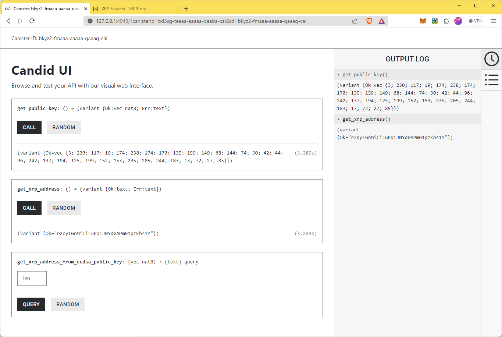
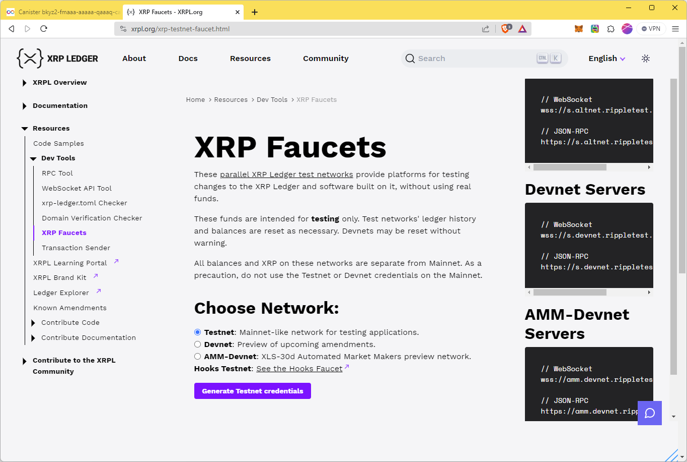
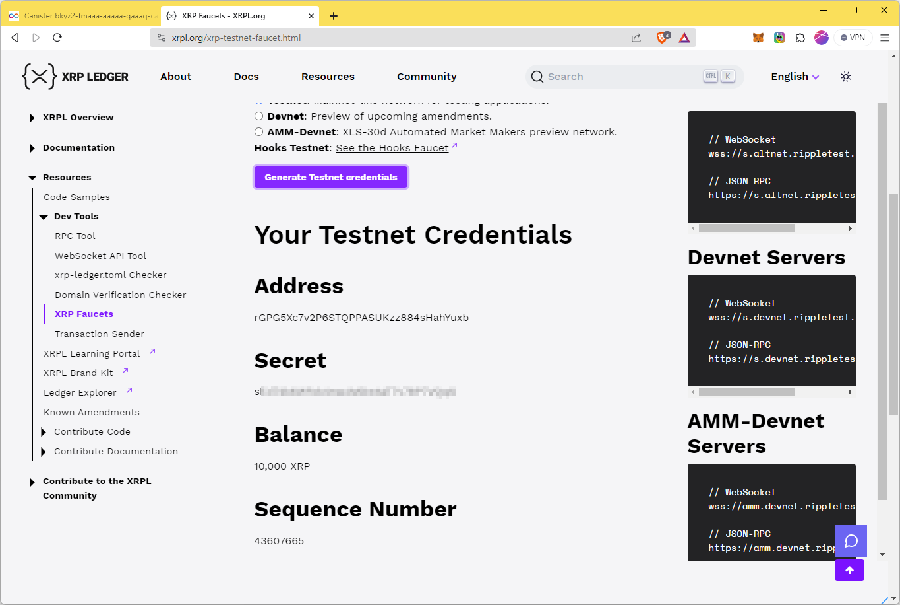
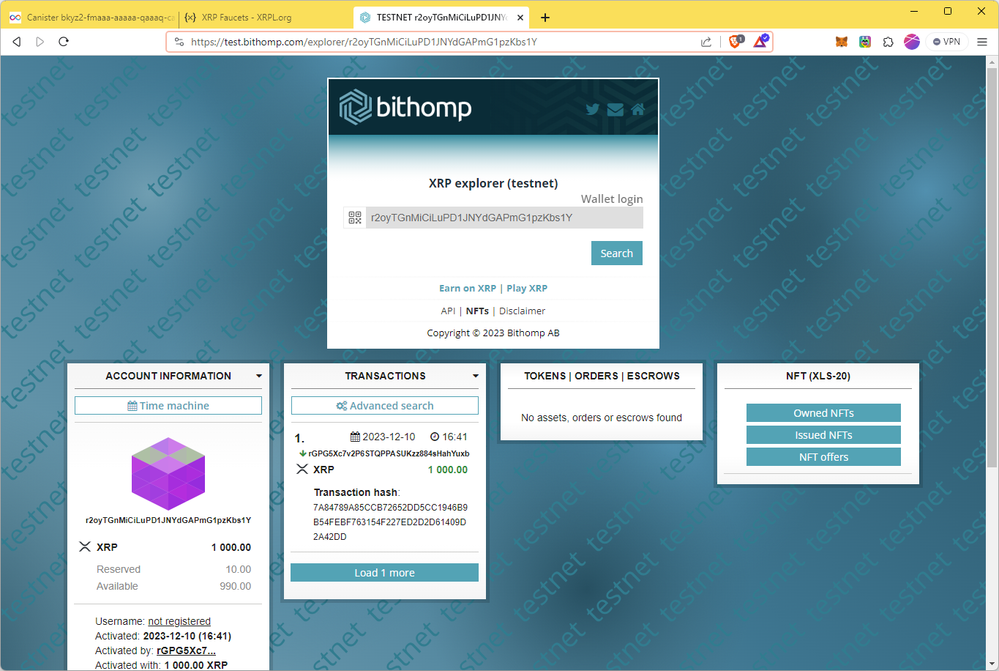

# Threshold ECDSA

Internet ComputerのCanister上で、Threshold ECDSAという仕組みを利用して署名を行うことができます。

大きな特徴は、Canisterの各replicaがPrivate keyの断片のみを持っていて、Private keyを再構築することなくPublic keyの取得や署名が行えるため、Private keyが漏洩リスクがほぼ無いことです。

ICPではこの仕組みを利用することによって、CanisterがBitcoinの保持や操作を行い、さらにBTCを担保にICP上に[ckBTC](https://internetcomputer.org/docs/current/developer-docs/integrations/bitcoin/ckbtc)を発行したり（[Bitcoin統合](https://internetcomputer.org/docs/current/developer-docs/integrations/bitcoin/)）、Ethereumの保持やコントラクト操作を行い、さらにETHを担保にICP上にckETHを発行したり（[ETH統合](https://internetcomputer.org/ethereum-integration/)）、といったことを実現しています。

2023年12月時点で以下のシステムAPIが用意されています。

- [ecdsa_public_key()](https://docs.rs/ic-cdk/0.12.0/ic_cdk/api/management_canister/ecdsa/fn.ecdsa_public_key.html)
- [sign_with_ecdsa()](https://docs.rs/ic-cdk/0.12.0/ic_cdk/api/management_canister/ecdsa/fn.sign_with_ecdsa.html)

## XRPL Interaction

Threshold ECDSAを使う身近な例がないかを考えたとき、自分がCryptoの世界に足を踏み入れた2018年当時、『XRP Ledger』まわりのAPIを触ったりしていたことをふと思い出しました。当時はまだPoWが主流で、BNB ChainなどEVM互換ChainやPoSのPolkadotやAvalancheもローンチされておらず、BitcoinやEthereumに比べると、XRPLのトランザクション処理速度は魅力的なものでした。

自分の関心はその後EthereumおよびEVM互換Chain、そして、ICPへと移ってしまったため、その後の技術をあまりフォローできていないのですが、XRPL上でNFTを扱えるようになっていたり、EVM互換Sidechainの検証が行われていたり、さらなる進化を遂げているようです。

自分はICPeopleですから、ICPのCanister上からXRPLへのインタラクションが行えないか、という点で、以下の2点を試してみたいと思います。

- Public keyからのXRP Address導出
- XRPLトランザクション署名 (XRP送金)

## 1. XRP Ledger Address derivation from Public key

XRP Ledger addressesは、rからはじまる25～35バイトの文字列です。4年前くらいに[調査](https://ledger.hatenablog.com/entry/2019/05/07/225332)した記憶が正しければ、[ecdsa-secp256k1](https://en.bitcoin.it/wiki/Secp256k1)、もしくは[ed25519](https://en.wikipedia.org/wiki/EdDSA#Ed25519)のPublic keyから生成できたはずなので試してみます。

##### Address Encoding

[https://xrpl.org/addresses.html#address-encoding](https://xrpl.org/addresses.html#address-encoding)


### ファイル準備

###### [dfx.json](dfx.json)

```json
{
  "canisters": {
    "backend": {
      "candid": "./backend.did",
      "package": "icptest",
      "type": "rust"
    }
  },
  "defaults": {
    "build": {
      "args": "",
      "packtool": ""
    }
  },
  "version": 1
}
```

###### [backend.did](backend.did)

まずはpublic keyの取得とPublic keyからのアドレス導出をしてみます。

★TODO★ XRPLトランザクション署名

```
type ResultBlob = variant { Ok: blob; Err: text };
type ResultText = variant { Ok: text; Err: text };

service : {
    "get_xrp_address_from_ecdsa_public_key": (blob) -> (text) query;
    "get_public_key": () -> (ResultBlob);
    "get_xrp_address": () -> (ResultText);
}
```

##### [Cargo.toml](Cargo.toml)

```bash
$ cargo add candid ic-cdk
$ cargo add base-x --no-default-features
$ cargo add ripemd --no-default-features
$ cargo add sha2 --no-default-features
$ cargo add serde --no-default-features --features=derive
```

```toml
[package]
name = "icptest"
version = "0.1.0"
edition = "2021"

[lib]
crate-type = ["cdylib"]

[dependencies]
base-x = { version = "0.2.11", default-features = false }
candid = "0.10.0"
ic-cdk = "0.12.0"
ripemd = { version = "0.1.3", default-features = false }
serde = { version = "1.0.193", default-features = false, features = ["derive"] }
sha2 = { version = "0.10.8", default-features = false }
```

##### [src/lib.rs](src/lib.rs)

主要な部分を抜粋します。

#### (1) get_public_key()

ICPのシステムAPIを使用してpublic keyを取得します。

Dfinityが提供しているサンプルを参考に実装しています。

[https://github.com/dfinity/examples/blob/master/rust/threshold-ecdsa/src/ecdsa_example_rust/src/lib.rs](https://github.com/dfinity/examples/blob/master/rust/threshold-ecdsa/src/ecdsa_example_rust/src/lib.rs)

ローカルテスト用なので`dfx_test_key`を指定しています。IC上に配置する場合は適宜修正した方がいいでしょう。

```rust
#[update]
async fn get_public_key() -> Result<Vec<u8>, String> {
  let request = ECDSAPublicKey {
    canister_id: None,
    derivation_path: vec![],
    key_id: EcdsaKeyId {
      curve: EcdsaCurve::Secp256k1,
      name: "dfx_test_key".to_string(),
    }
  };

  let (res,): (ECDSAPublicKeyReply,) =
    ic_cdk::call(Principal::management_canister(), "ecdsa_public_key", (request,))
      .await
      .map_err(|e| format!("ecdsa_public_key failed {}", e.1))?;

  Ok(res.public_key)
}
```

#### (2) get_xrp_address_from_ecdsa_public_key()

Public keyからXRPL Addressを

```rust
#[query]
fn get_xrp_address_from_ecdsa_public_key(public_key: Vec<u8>) -> String {
}
```

### 実行例

Public keyやXRP Addressの取得を行います。



### XRPL Testnet Faucet

生成されたアドレスが有効かどうか、XRPL Testnet Faucetで受け取ったXRPを送金してみましょう。



`[Generate Testnet Credentials]`をクリックすると、テスト用の10,000 XRPが入ったWalletのSecretやAddressを受け取れます。



生成したアドレスへ送金するには、[XUMM](https://xumm.app/)などのWalletアプリもありますが、Testnetですし、プログラムでも簡単に送金できますので、以下のようなプログラムで1,000 XRPを送ることにします。

```javascript
const xrpl = require('xrpl');

const wallet = xrpl.Wallet.fromSeed("＜Faucetで表示されたSecret＞");

// Wrap code in an async function so we can use await
async function main() {
  // Testnet
  const client = new xrpl.Client("wss://s.altnet.rippletest.net:51233");
  // Production
  //const client = new xrpl.Client('wss://xrplcluster.com')

  await client.connect();

  // STEP-1: Transaction
  const prepared = await client.autofill({
    "TransactionType": "Payment",
    "Account": wallet.address,
    "Amount": xrpl.xrpToDrops("1000"),
    "Destination": "＜生成されたアドレス＞" // local canister
  });
  const max_ledger = prepared.LastLedgerSequence;
 
  // STEP-2: Sign
  const signed = wallet.sign(prepared);

  // STEP-3: Submit
  const tx = await client.submitAndWait(signed.tx_blob);

  await client.disconnect();
}

main();
```

### 残高確認

生成したアドレスに正しく送金できているかbithompで残高確認してみましょう。

[https://test.bithomp.com/](https://test.bithomp.com/)



以下のようにプログラム的に確認することもできます。

```javascript
const xrpl = require("xrpl");

async function main() {
  const client = new xrpl.Client("wss://s.altnet.rippletest.net:51233");
  await client.connect();

  const response = await client.request({
    command: "account_info",
    account: "r2oyTGnMiCiLuPD1JNYdGAPmG1pzKbs1Y",
    ledger_index: "validated",
  });
  console.log(response?.result?.account_data);

  client.disconnect();
}

main();
```

```
{
  Account: 'r2oyTGnMiCiLuPD1JNYdGAPmG1pzKbs1Y',
  Balance: '1000000000',
  Flags: 0,
  LedgerEntryType: 'AccountRoot',
  OwnerCount: 0,
  PreviousTxnID: '7A84789A85CCB72652DD5CC1946B9B54FEBF763154F227ED2D2D61409D2A42DD',
  PreviousTxnLgrSeq: 43607823,
  Sequence: 43607823,
  index: '2FE52F0C17F6B6A9521268347229FA555753F440DA5F7BF54421BB14AC67CC40'
}
```

### 注意事項

経験則的に、新しくCanisterを作り直すたびにPublic keyも変わるようですので、ご注意ください。

現時点ではまだトランザクション操作も実装していませんので、生成されたXRPL Addressに本物のXRPは送らないようにしてください。取り戻せなくなる可能性があります。

本記事の内容はあくまでも参考にとどめ、くれぐれも自己責任のもとで動作テスト等を行ってくださいますようお願いします。


## 2. Sign and Submit XRPL Transaction

ICP Canister上からXRPLに対してトランザクション要求を発行します。

★TODO★ 調査中
