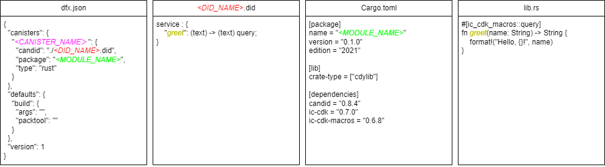

# Hello, again

[前回](./test0001_hello)はdfx newコマンドを使ってプログラムを生成したけれども、出力されるファイルが多すぎて分かりづらいので、スクラッチからビルドしてみることにしましょう。

本ドキュメントではBackendを中心に解説しますのでFrontendは用意しません。

## 1. プロジェクトの作成

まずはRustの一般的なライブラリプロジェクトを作成します。

「test0002_helloagain」はプロジェクト名ですので、任意に設定して構いません。

```
$ cargo new test0002_helloagain --lib
$ cd test0002_helloagain
```

## 2. プロジェクト資材準備

### (1) dfx.json

以下のようなdfx.jsonを用意してみましょう。

```dfx.json
{
  "canisters": {
    "helloagain": {
      "candid": "./helloagain.did",
      "package": "test0002_helloagain",
      "type": "rust"
    }
  },
  "defaults": {
    "build": {
      "args": "",
      "packtool": ""
    }
  },
  "version": 1
}
```

### (2) didファイルの作成

###### helloagain.did

```
service : {
    "greet": (text) -> (text) query;
}
```
### (3) Cargo.toml修正

```
[package]
name = "test0002_helloagain"
version = "0.1.0"
edition = "2021"

[dependencies]
```

#### a. create-type追加

ライブラリセクションを追加するとよいでしょうか。cdylib は最終成果物の .wasm ファイル（＝動的ライブラリ）を

```
[lib]
crate-type = ["cdylib"]
```
#### b. create-type追加

```bash
$ cargo add candid ic-cdk ic-cdk-macros
```
### (4) Cargo.lock作成

一般にcargo buildを実行すればCargo.lockは生成されます。一方、後述のdfx buildコマンド (dfx deploy)では、内部的にcargo buildコマンドを「--locked」オプションで実行しているようなので、事前にCargo.lockファイルを用意しておく必要があります。

```bash
$ cargo generate-lockfile
```

### (5) プログラム

##### src/lib.rs

```rust
#[ic_cdk_macros::query]
fn greet(name: String) -> String {
    format!("Hello, {}!", name)
}
```

## 2. ビルド

DappsをビルドしてローカルPC上にCanisterに配置する手順を以下に示します。

### (1) サービス起動


まずは、ローカルPC上にCanister実行環境を起動します。`dfx start`コマンドで行います。以下に実行例を示します。

```
$ dfx start --clean --background
```
起動オプションの詳細は[公式ドキュメント](https://internetcomputer.org/docs/current/references/cli-reference/dfx-start)を参考にするとよいでしょう。

`--clean`オプションをつけると、起動時にCanisterを初期化します。初回起動、もしくは`--clean`でサービスを起動した時点ではCanisterは一つも登録されていません。

`--background`オプションをつけるとコマンドが復帰し、サービスがバックグラウンドで起動されます。起動したサービスは、`dfx stop`コマンドで停止できます。

### (2) Canister作成

作成したDappを配備先のCanisterを作成します。

```
$ dfx canister create helloagain
```

Canisterが一つも登録されていない状況から本コマンドを実行した場合、作成するCanisterのほかに、Wallet Canisterが作成されます。Internet Computerでは Dappsを実行させるための Cycle と呼ばれる燃料に相当するものが必要です。

本番環境では ICPトークンを Cycle に変換でき、Dappを実行させるコストがかかります。一方、ローカル環境の場合にも、コストはかかりませんが Cycle の仕組みがあり、作成されたWallet Canisterで管理されています。
### (3) ビルド

Canisterに配備するwasmモジュールをビルドします。

```
$ dfx build
```

`target/wasm32-unknown-unknown/release/`ディレクトリにwasmモジュールが生成され、Canister向けに最適化されたモジュールが、`./.dfx/local/canisters/<Canister名>/<canister名>.wasm`に格納されます。

### (4) 配備

```
$ dfx deploy
```

簡易UIのCanisterも用意されます。このCanisterを使うことで、WebページからDappsへ簡易のリクエストを発行できます。

### 補足

なお、手順(2)～(3)は、`dfx deploy`コマンドを実行する過程で必要に応じて実行されます。説明のため記載しましたが、実際の作業では省略して構いません。

## まとめ




||||
|Canister Name|||
||