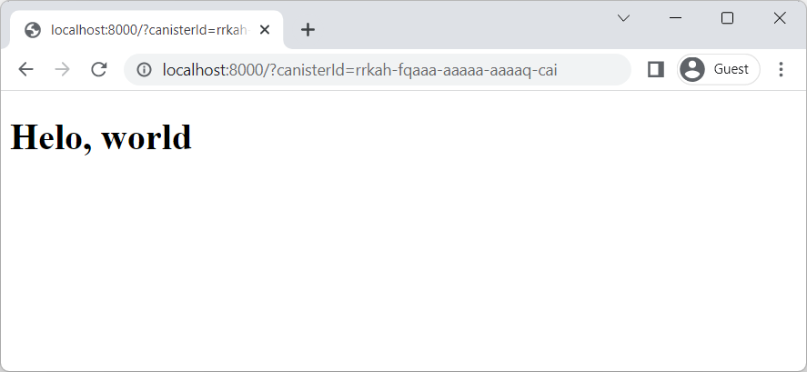

# frontend01: シンプルなHTML

Internet ComputerのDappとして、WebのFrontendを動かすには、[Asset Canister](https://github.com/dfinity/sdk/tree/master/src/canisters/frontend/ic-frontend-canister)を使用します。

[公式マニュアル](https://internetcomputer.org/docs/current/developer-docs/frontend/)には、React Frameworkを使ったサンプルがありますが、まずはFrameworkを使わず、Backendとも通信を行わない単純なHello, Worldを表示するWebページの最小構成について押さえておきたいと思います。

仕組みと最小構成が分かれば、そこからボトムアップで積み上げていくことができますから、後でNext.jsやFlutterなど自分のお気に入りのFrameworkを使って、Backendとも通信を行うFrontendをCanisterへ配備することもできるようになるでしょう。

ここで解説するFrontendでは、以下の設定を想定しています。

|項目         |値     |
|:------------|:------|
|Canister Name|icptest|

## ファイル構成

Canisterとは通信を行わず、ルートドキュメントのHTMLを返すだけのシンプルな構成の場合、以下の2ファイルを用意するだけです。

- dfx.json
- dist/index.html

###### [dfx.json](https://github.com/toshio/icptest/blob/master/development/test0004_frontend01_simple/dfx.json)

```json
{
  "canisters": {
    "icptest": {
      "frontend": {
        "entrypoint": "dist/index.html"
      },
      "source": [
        "dist/"
        ],
      "type": "assets"
    }
  },
  "defaults": {
    "build": {
      "args": "",
      "packtool": ""
    }
  },
  "output_env_file": ".env",
  "version": 1
}
```

###### [dist/index.html](https://github.com/toshio/icptest/blob/master/development/test0004_frontend01_simple/dist/index.html)

```html
<!DOCTYPE html>
<html>
  <body>
    <h1>Helo, world</h1>
  </body>
</html>
```

## ローカル実行環境の準備

`dfx start`でローカルPC環境で動作するCanisterを起動します。

```bash
$ dfx start --background --clean
```

`dfx deploy`コマンドを実行することでCanisterへ配置できます。`dfx deploy`コマンドは、Canisterが無ければつくってくれますので、別途`dfx canister create`コマンド等を実行する必要は不要です。

```bash
$ dfx deploy
︙
Uploading assets to asset canister...
Starting batch.
Staging contents of new and changed assets:
  /index.html 1/1 (75 bytes) sha 7a5fe09fb12f60b99511ddab85e329ba8774c71aba3df1a4616ea7438d49f442 
Committing batch.
Deployed canisters.
URLs:
  Frontend canister via browser
    icptest: http://127.0.0.1:8000/?canisterId=rrkah-fqaaa-aaaaa-aaaaq-cai
```

## 実行画面




## ポート番号固定

配備したFrontendのポート番号は、以下のような定義ファイルを用意しておくことで固定にできます。
##### $HOME/.config/dfx/networks.json

```json
{
  "local": {
    "bind": "127.0.0.1:8000",
    "type": "ephemeral",
    "replica": {
      "subnet_type": "system"
    }
  }
}
```

## ローカル実行環境の停止方法

`dfx start`で `--background`を指定したサービスは、以下のコマンドで停止できます。

```bash
$ dfx stop
```
