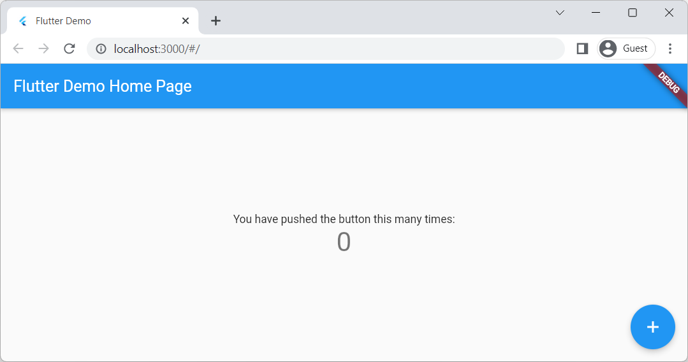
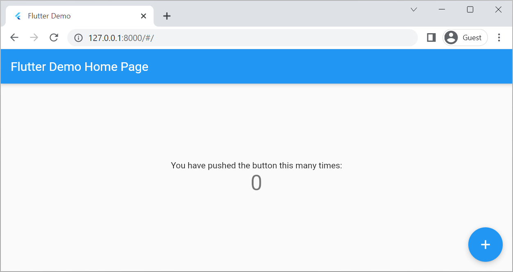

# frontend02: Flutter Webページ

Flutterは、Googleなどによって開発されたオープンソースのFrameworkで、Android、iOS、Windows、Webなど様々なプラットフォームで動作するアプリケーションを開発できるクロスプラットフォームが特徴です。

ここでは、FlutterでつくられたWebアプリケーションをCanisterに配置する方法について解説します。まずは、Webアプリケーションとして、プロジェクトを作成した際に生成されるサンプルをCanisterで動作させてみましょう。

## Flutterのインストール

Flutterのインストールは公式ドキュメントを参照ください。筆者は、WindowsのWSL環境 (Ubuntu)を使用しています。

[https://docs.flutter.dev/get-started/install](https://docs.flutter.dev/get-started/install)

## Flutter Webプロジェクトの作成

Flutterでサンプルを作成するには、`flutter create`コマンドを実行します。AndroidやiOS向けアプリは開発せず、Webページのみですので、`--platforms=web`を指定します。

ここでは、プロジェクト名を『icptest』としますが、お好みに合わせて適宜変更するとよいでしょう。コマンドを実行すると、プロジェクト名のディレクトリが作成されます。

```bash
$ flutter create --platforms=web icptest
$ cd icptest
```

プロジェクトフォルダ内に、サンプルプログラムの実行に必要な資材一式が作成されます。

```
icptest
├── analysis_options.yaml
├── icptest.iml
├── lib
│   └── main.dart
├── pubspec.lock
├── pubspec.yaml
├── README.md
├── test
│   └── widget_test.dart
└── web
    ├── favicon.png
    ├── icons
    │   ├── Icon-192.png
    │   ├── Icon-512.png
    │   ├── Icon-maskable-192.png
    │   └── Icon-maskable-512.png
    ├── index.html
    └── manifest.json
```

本ドキュメントはFlutterの解説が目的ではありませんので、作成された資材や開発方法についての説明しませんが、Flutter Webの動作確認は以下のような方法で行うことができるでしょう。詳細はFlutterのドキュメントを参考にしてください。

```bash
$ flutter run -d chrome
```

筆者はWindowsのWSL環境 (Ubuntu)を使っているためWSLから直接chromeと連携できないため、以下のようにWebサーバを起動して、Windows側のChromeで動作確認しています。

```bash
$ flutter run -d web-server --web-port=3000
```



## ICP Asset Canisterへの配置

Flutterでは、`flutter build web`コマンドでリリース向けにビルドすると、build/webディレクトリに配備資材が作成されます。このディレクトリをWebサーバに配置することでWebアプリケーションとして動作します。

詳細はFlutterの [https://docs.flutter.dev/deployment/web](https://docs.flutter.dev/deployment/web)などを参照して下さい。

ですから、build/webディレクトリをAsset Canisterに配備することで、ICPのFrontendでFlutterでつくられてWebアプリケーションを動作させることができるはずです。

### リリース向けビルド

```bash
$ flutter build web
```

### dfx.jsonの作成

Flutterが出力した配備資材一式をICPのFrontendに配置するために、以下の設定例でdfx.jsonを作成します。

|Name         |Value               |Remarks    |
|:------------|:-------------------|:----------|
|Canister name|icptest             |任意       |
|entrypoint   |build/web/index.html|Flutter固定|
|source       |build/web           |Flutter固定|


##### dfx.json

```json
{
  "canisters": {
    "icptest": {
      "frontend": {
        "entrypoint": "build/web/index.html"
      },
      "source": [
        "build/web"
        ],
      "type": "assets"
    }
  },
  "defaults": {
    "build": {
      "args": "",
      "packtool": ""
    }
  },
  "output_env_file": ".env",
  "version": 1
}
```

### ICPローカル実行環境の準備

`dfx start`でローカルPC環境で動作するCanisterを起動します。

```bash
$ dfx start --background --clean
```

### Canister作成&配備

`dfx deploy`コマンドを実行することでCanisterへ配置できます。`dfx deploy`コマンドは、Canisterが無ければつくってくれますので、別途`dfx canister create`コマンド等を実行する必要は不要です。

```bash
$ dfx deploy
︙
Deployed canisters.
URLs:
  Frontend canister via browser
    icptest: http://127.0.0.1:8000/?canisterId=rrkah-fqaaa-aaaaa-aaaaq-cai
```

ICPのローカルCanisterに配置しても、サンプルが動作することを確認できました。


