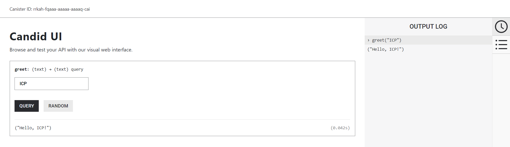

# テンプレート生成 (dfx new)

まずはじめに、最もシンプルなHelloを返すDappsを開発してみます。

`dfx new`コマンドを実行して自動生成されるもので、以下の2つのCanisterで構成されます。

- Backend Canister
- Frontend Canister

## プロジェクト作成

`dfx new`コマンドをコマンドを実行すると、Backend開発に使用するプログラミング言語やFrontendのフレームワークなどを対話形式で訊かれた後、サンプルアプリケーションが自動生成されます。

『hello』はプロジェクト名ですので、適宜変更しても構いません。

```bash
$ dfx new hello
```

##### Backendのプログラミング言語の選択

```bash
$ dfx new hello
? Select a backend language: ›  
  Motoko
❯ Rust
  TypeScript (Azle)
  Python (Kybra)
```

##### Frontend frameworkの選択

```bash
? Select a frontend framework: ›  
❯ SvelteKit
  React
  Vue
  Vanilla JS
  No JS template
  No frontend canister
```

##### Extra featuresの選択

```bash
? Add extra features (space to select, enter to confirm) ›
⬚ Internet Identity
⬚ Bitcoin (Regtest)
```

### ディレクトリ構成

```bash
hello
├── .git
│    ︙
├── .gitignore
├── Cargo.lock
├── Cargo.toml
├── README.md
├── dfx.json
├── node_modules
│    ︙
├── package-lock.json
├── package.json
├── src
│   ├── hello_backend
│   │    ︙
│   └── hello_frontend
│        ︙
└── tsconfig.json
```

## Local Canister実行環境の起動

Dapps開発時は本番環境に配備する必要はなく、ローカルPC内に配備します。

`dfx start`コマンドで、Local Canister実行環境を起動します。サービスを起動した後にコマンドラインを復帰させたい場合「--background」オプションを付与するとよいでしょう。

「--clean」はサービス起動時にCanisterを初期化するためのオプションです。

```bash
$ cd hello
$ dfx start --clean --background
Running dfx start for version 0.19.0
Using the default definition for the 'local' shared network because /home/toshio/.config/dfx/networks.json does not exist.
Initialized replica.
Dashboard: http://localhost:37463/_/dashboard
```

## ローカル環境へのDeploy

```bash
$ dfx deploy
︙
Deployed canisters.
URLs:
  Frontend canister via browser
    hello_frontend:
      - http://127.0.0.1:4943/?canisterId=bd3sg-teaaa-aaaaa-qaaba-cai
      - http://bd3sg-teaaa-aaaaa-qaaba-cai.localhost:4943/
  Backend canister via Candid interface:
    hello_backend: http://127.0.0.1:4943/?canisterId=be2us-64aaa-aaaaa-qaabq-cai&id=bkyz2-fmaaa-aaaaa-qaaaq-cai
```

※Canister IDは環境によって変わります。

## 実行

Webブラウザーでそれぞれアクセスしてみましょう。

### Dashboard


### Frontend


### Backend



## 解説

生成されたアプリケーションは大きくFrontendとBackendの2種類があります。本ドキュメントではとくにBackend側に着目して、どのような仕組みとなっているかを紐解き、1ステップずつ開発方法を学んでいきたいと思います。

生成されたファイルのうち、Backendを動作させるのに最低限必要な設定ファイルは以下となります。
- dfx.json
- didファイル
- Cargo.toml
- lib.rs

###### dfx.json

```json
{
  "canisters": {
    "hello_backend": {
      "candid": "src/hello_backend/hello_backend.did",
      "declarations": {
        "node_compatibility": true
      },
      "package": "hello_backend",
      "type": "rust"
    },
    "hello_frontend": {
      "dependencies": [
        "hello_backend"
      ],
      "source": [
        "src/hello_frontend/dist"
      ],
      "type": "assets",
      "workspace": "hello_frontend"
    }
  },
  "defaults": {
    "build": {
      "args": "",
      "packtool": ""
    }
  },
  "output_env_file": ".env",
  "version": 1
}
```

###### src/hello_backend/hello_backend.did

開発したアプリケーションは外部からどのように呼ばれるか、I/Fを規定します。

```text
service : {
    "greet": (text) -> (text) query;
}
```

##### src/hello_backend/Cargo.toml

```ini
[package]
name = "hello_backend"
version = "0.1.0"
edition = "2021"

# See more keys and their definitions at https://doc.rust-lang.org/cargo/reference/manifest.html

[lib]
crate-type = ["cdylib"]

[dependencies]
candid = "0.10"
ic-cdk = "0.13"
ic-cdk-timers = "0.7" # Feel free to remove this dependency if you don't need timers
```

###### src/hello_backend/src/lib.rs

```rust
#[ic_cdk::query]
fn greet(name: String) -> String {
    format!("Hello, {}!", name)
}
```
